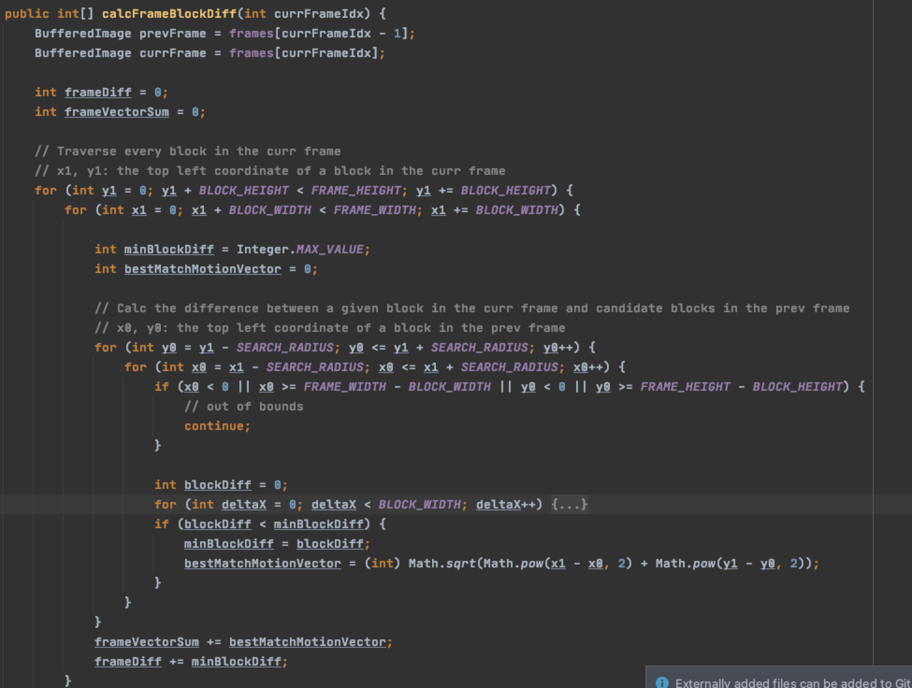
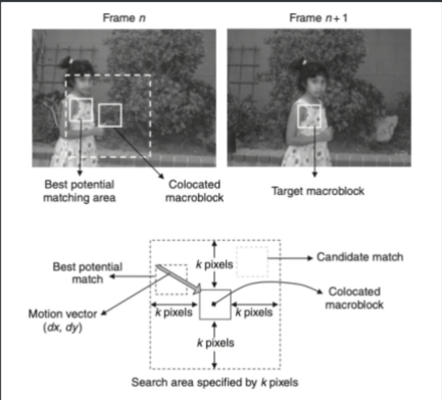

# VideoSummarizer

## Note
This is a just a brief draft. 
Complete descrition and code will be uploaded once the project evaluation is done.

## Problem Description

A 9 minutes video is represented by a set of frames (rgb file) and an audio file. You are asked to summarize it into a 90 seconds video to include main or important occurrences, scenes, etc., and to provide an easily interpretable or a highlight synopsis of the video.

## Outline:

1. Create a video/audio player that will display them synchronized.
2. Break the input video into a list of logical segments – shots
3. Give each shot a quantitative weighting value, piece together a new video using specific high weight age shots or even parts of shots.
4. Display the video/audio.

## Shot Boundary Detection:

Reference:  [https://en.wikipedia.org/wiki/Shot_transition_detection](https://en.wikipedia.org/wiki/Shot_transition_detection)

Cut detection works on a two-phase-principle:

1. **Scoring** – Each pair of consecutive frames of a digital video is given a certain score that represents the similarity/dissimilarity between them.
2. **Decision** – All scores calculated previously are evaluated and a cut is detected if the score is considered high.

### Sum of absolute differences

The two consecutive frames are compared pixel by pixel, summing up the absolute values of the differences of each two corresponding pixels. 

SAD is used often to produce a basic set of "possible hits" as it detects all visible hard cuts with utmost probability (correct hits)

SAD hardly reacts to soft cuts at all. (missed hits)

SAD is very sensitive to luminance changes or object and camera motion, leading to a high ratio of false alarms (false hits)

→ Sum of absolute differences based on blocks

Instead of calculating pixel-by-pixel difference, we divide the frame into macro-blocks of a selected size. For each macro-block, we find the best match block within a selected range in the previous frame, and calculate the difference. The whole frame difference would be the sum of differences between macro-blocks and their best match blocks.

In this method, we can avoid some false hits caused by object or camera motions.

Two factors that will influence the quality of this method

1. Block Size: Smaller blocks tend to have smaller error compared to large blocks
2. Search Radius: The value typically ranges from 0 to 31, and is set depending on how fast objects or regions are moving from frame to frame. For fast motion, better predictions are obtained with larger k values because fast-moving objects tend to move farther from frame to frame.

### Histogram differences

a. RGB 

b. HSV 

As an alternative, we can evaluate the color histogram in the HSV space due to its similarity and perceptivity characteristics. This color space is defined according to human color perception. Perceptibly similar colors are situated within close quantization levels, otherwise dissimilar colors belong to different far quantization levels.  As in RGB color space, we have a number of quantization levels according to the number of bits of each component. In that case, we are going to distinguish hue component from saturation and value component. The main reason is that visual human system is more sensitive to hue variations than saturation and value variations. 

Reference: 

[https://www-nlpir.nist.gov/projects/tvpubs/tvpapers03/ramonlull.paper.pdf](https://www-nlpir.nist.gov/projects/tvpubs/tvpapers03/ramonlull.paper.pdf)

This method can remove some false hits due to motion and light changes (some illumination changes, but not able to rule out false hits where overall hues are quite different)

### Potential Improvement:

1. Edge Change Ratio: The ECR attempts to compare the actual content of two frames. It transforms both frames to edge pictures, i. e. it extracts the probable outlines of objects within the pictures (see edge detection for details). Afterwards it compares these edge pictures using dilation to compute a probability that the second frame contains the same objects as the first frame.
2. Different combinations of scoring methods

### Decision:

In the decision phase the following approaches are usually used:

- **Fixed Threshold** – In this approach, the scores are compared to a threshold which was set previously and if the score is higher than the threshold a cut is declared.
- **Adaptive Threshold** – In this approach, the scores are compared to a threshold which considers various scores in the video to adapt the threshold to the properties of the current video. Like in the previous case, if the score is higher than the corresponding threshold a cut is declared.
- Machine Learning - It's not used in this project, but could be potential improvement for the future

We used adaptive threshold:

Qualitatively speaking, we assume frame difference has a distribution similar to normal distribution or some variants of normal distributions.

Therefore, we use (mean + 2 standard * deviation) as our threshold

## Shot Evaluation

1. 35% from motion characteristics: We assume fast motion is more important than slow motion. The frame motion value would be the sum of magnitude of motions vectors defined by each macro-block and its best match macro-block in the previous frame
2. 35% from audio intensity: We assume high audio levels, such as cheering, are more exciting than low audio levels or silence. 
3. 30%: color characteristics: a variance of colors can be construed to be more important than constant colors.  We evaluate color variance by hue histograms. 

potential improvement:

1. face detection: more faces means higher importance.
2. correlation of features mentioned above.
